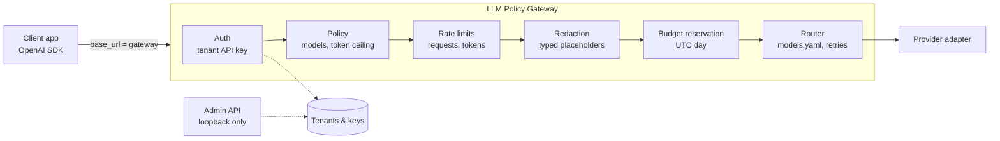

# LLM Policy Gateway

An OpenAI-compatible HTTP gateway that sits between your applications and the
language models they call, and enforces tenant policy in code the application
cannot bypass. Applications change one base URL. Everything else stays the same.

> **Status: under active development.** Authentication, tenant policy, model
> routing, redaction, budgets, rate limits and the OpenAI-compatible endpoints
> work today. Injection screening, audit logging and streaming are next. The roadmap below
> tracks what is done.

## Why it exists

Teams in healthcare billing, finance and other regulated work tend to stall on
the same three questions before an LLM feature ships: what data actually
reached the model, who is allowed to call which model, and what stops a runaway
loop from spending the month's budget overnight. Most answers are a policy
document. This project makes the answers mechanical: every request passes
through the same checks, and a request that fails a check never reaches a
provider.

## What works today

- **OpenAI-compatible endpoints.** `POST /v1/chat/completions`,
  `POST /v1/embeddings` and `GET /v1/models`. The official `openai` Python SDK
  works against the gateway by changing only `base_url` and `api_key`, and the
  test suite proves it.
- **Tenant API keys.** Keys are shown once at creation. Only a prefix and a
  peppered HMAC-SHA256 digest are stored. Unknown, wrong and revoked keys all
  get the same 401 and take the same code path.
- **Deny-by-default policy.** Each tenant gets an allowlist of models, a token
  ceiling and other limits in `policy.yaml`. A tenant missing from the file is
  refused. The file is validated at startup, and a typo stops the process with
  the line number instead of being silently ignored.
- **Checks before the model call.** A disallowed model, an over-limit token
  request or a bad key gets rejected before any provider is contacted. Tests
  assert zero upstream calls in each case.
- **Request redaction.** Configured tenants replace recognized sensitive values
  with typed placeholders before routing. A redaction failure refuses the
  request. Response re-identification is optional and disabled by default.
- **Daily budgets and rate limits.** Prices are explicit for each public model.
  A request reserves its estimated maximum cost before the provider call, then
  settles against reported usage. Tenant request and token buckets limit bursts.
- **Explicit routing.** `models.yaml` maps public model names to a provider and
  upstream model. There is no silent fallback to a different model. Transient
  upstream errors are retried with jittered backoff, then surfaced as a 502.
- **Whitelisted payloads.** Only known request fields are forwarded upstream.
  Anything else a client sends is dropped.
- **Separate admin plane.** Tenant and key management runs on its own port,
  bound to loopback unless explicitly allowed, behind its own token.

## Architecture



## Running it locally

Requires Python 3.11 or newer.

```sh
python -m venv .venv
python -m pip install -e ".[dev]"
make models  # install the configured English language model

cp policy.example.yaml policy.yaml
cp models.example.yaml models.yaml
cp pricing.example.yaml pricing.yaml

# Required secrets. Generate your own; these are examples only.
export KEY_PEPPER="$(python -c 'import secrets; print(secrets.token_urlsafe(48))')"
export ADMIN_TOKEN="$(python -c 'import secrets; print(secrets.token_urlsafe(32))')"

make migrate                          # create the database schema
lpg tenant create clinical-team       # prints the tenant id
lpg key create <tenant-id> --label dev   # prints the key once
make serve                            # gateway on :8080, admin on 127.0.0.1:8081
```

Then call it like any OpenAI endpoint:

```python
from openai import OpenAI

client = OpenAI(base_url="http://127.0.0.1:8080/v1", api_key="lpg_...")
reply = client.chat.completions.create(
    model="clinical-local",
    messages=[{"role": "user", "content": "Summarise this claim note."}],
)
```

The example configuration routes every model to a built-in mock provider, so
the whole flow runs without any model server. Every setting is documented in
`.env.example`.

## What reaches the model

For a tenant using the `phi` profile, a request such as `Jane Roe, SSN
123-45-6789` reaches the provider as `<PERSON_1>, SSN <US_SSN_1>` when both
values are recognized. The request-local mapping stays in memory; headers and
logs contain entity counts only. The `standard` profile covers common
identifiers, while `phi` also checks names, dates, locations and clinical
identifiers. A missing language model stops startup; run `make models` to
install the configured model. Local inference runs fully on-premises, no data
leaves the host.

## What stops a runaway loop

Before calling a provider, the gateway checks the tenant's request and token
rates, then reserves a worst-case cost against its UTC daily budget. A request
over either limit receives a 429 with no upstream call. Successful calls settle
at reported token usage; failed calls release their reservation. The admin API
and `lpg usage <tenant-id> [--day YYYY-MM-DD]` show daily totals.

SQLite budget reservations are atomic only within one gateway process. Run a
single gateway instance with SQLite; Postgres locks the tenant row for atomic
reservations across instances. Rate-limit buckets are per process; a shared
store is future work.

## Development

```sh
make test     # full suite, offline, no API keys needed
make lint     # ruff check and format check
make format
```

## Roadmap

- [x] Scaffold, CI
- [x] Tenants, API keys, policy validation, admin API and CLI
- [x] OpenAI-compatible endpoints, routing, retries, mock provider
- [x] PII/PHI redaction before any request leaves the gateway
- [x] Per-tenant daily budgets and rate limits
- [ ] Prompt-injection screening for tool and retrieved content
- [ ] Append-only audit log (fail-closed) and Prometheus metrics
- [ ] Streaming responses
- [ ] Ollama, Azure OpenAI, Amazon Bedrock and OpenAI adapters
- [ ] Redaction evaluation with published precision and recall

## Limitations

This is a reference implementation, not a certified compliance product. Today
it routes only to the mock provider. Redaction is probabilistic: names and
dates can be missed, and a measured miss rate will arrive with the evaluation
stage. Audit controls remain on the roadmap. Nothing here has been
load-tested.

## Licence

MIT. See [LICENSE](LICENSE).
